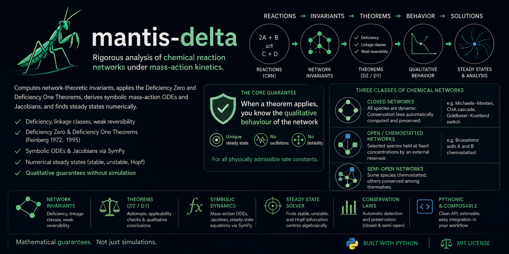
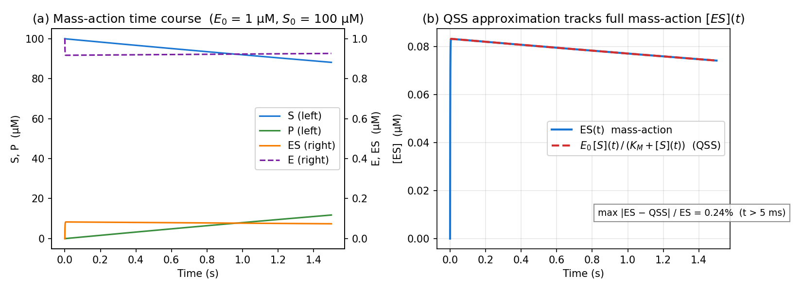
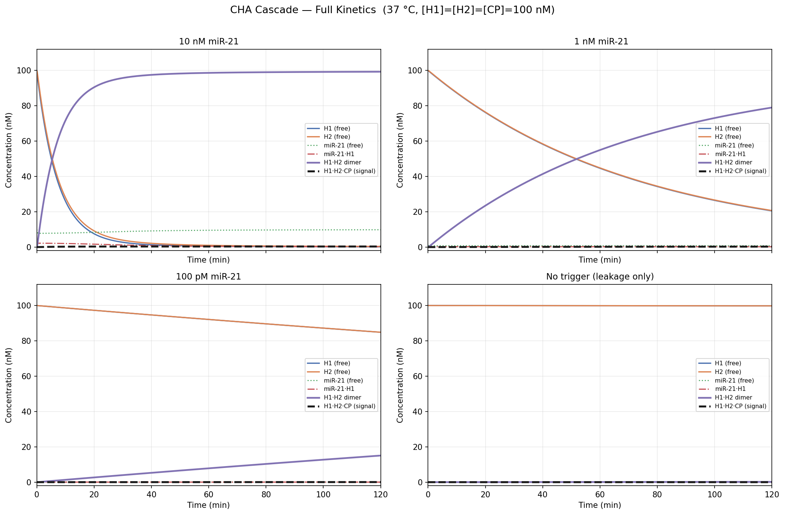
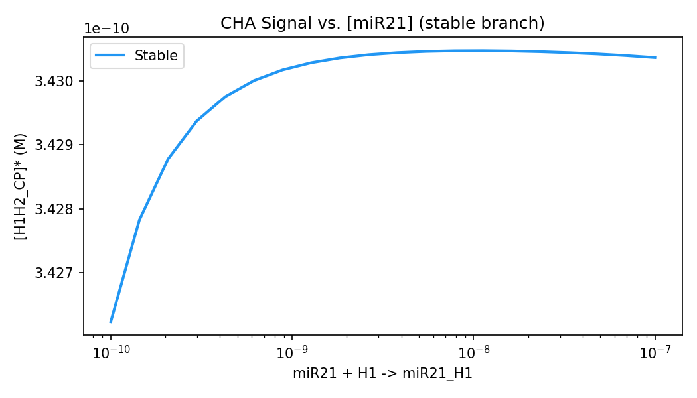
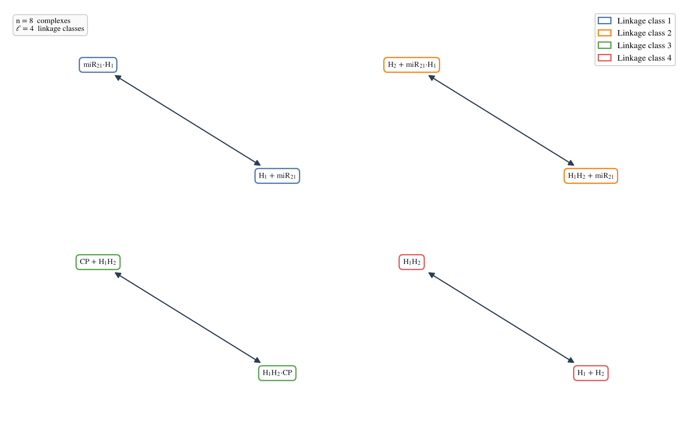
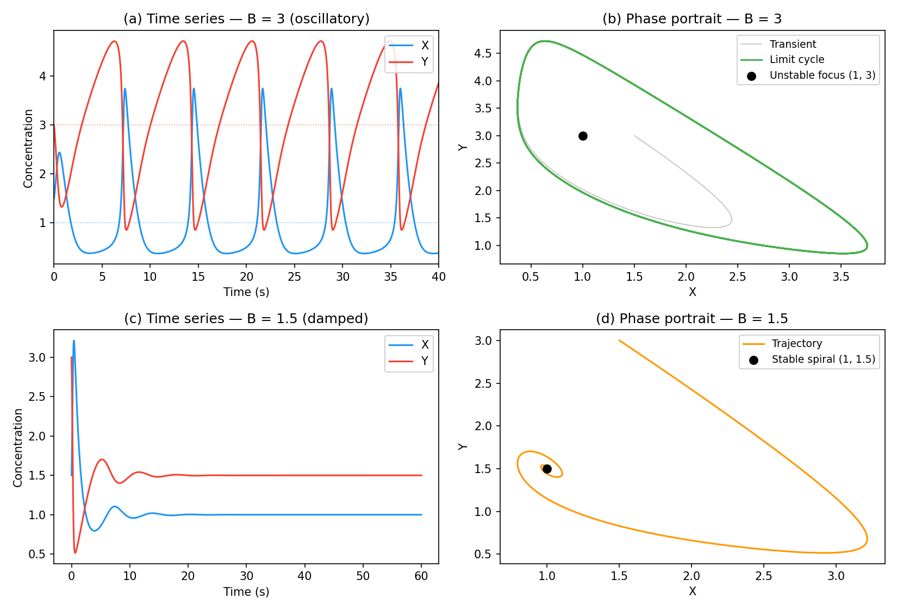
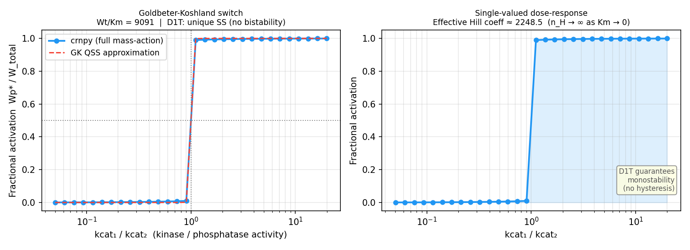

<p align="center">
  
</p>

<h1 align="center">mantis-delta</h1>
<p align="center"><em>Mass-Action Network Theory, Inference, and Stability for Chemical Reaction Networks</em></p>

<p align="center">
<a href="#running-the-tests"></a>
<a href="#installation"></a>
<a href="#license"></a>
</p>

**mantis-delta** is a Python library for rigorous structural and numerical analysis of chemical reaction networks (CRNs) under mass-action kinetics. Given a set of reactions, it computes network-theoretic invariants — deficiency, linkage classes, weak reversibility — applies the Deficiency Zero and Deficiency One Theorems (Feinberg 1972, 1995), derives symbolic mass-action ODEs and Jacobians via SymPy, and finds steady states numerically. The core guarantee the library provides is this: when a theorem applies, you know the qualitative behaviour of the network (unique steady state, no oscillations, no bistability) for *all* physically admissible rate constants — without running a single simulation.

Beyond the classical theorems, mantis-delta certifies **global** asymptotic stability (Horn–Jackson Lyapunov), detects **Absolute Concentration Robustness** (Shinar–Feinberg) and **injectivity** (Craciun–Feinberg), enumerates *all* steady states exhaustively (Gröbner / homotopy), tracks branches through folds and Hopf points by **pseudo-arclength continuation** and maps the **multistationarity parameter region** (Conradi–Feliu–Mincheva–Wiuf), and emits the **exact stochastic stationary distribution** of complex-balanced networks in closed form (Anderson–Craciun–Kurtz) alongside a Finite State Projection CME solver and SBML interoperability — a single pipeline from network structure to robustness, global stability, and analytic stochastics.

The library supports three classes of chemical networks:

- **Closed networks** — all species are dynamic; conservation laws are automatically computed and preserved by the solver (e.g. Michaelis-Menten, CHA cascade, Goldbeter-Koshland switch).
- **Open / chemostatted networks** — selected species are held at fixed concentrations by an external reservoir (e.g. Brusselator with A and B chemostatted). Chemostatted species are excluded from the ODE system and stoichiometry rank calculation but appear in flux expressions. The solver uses a pure algebraic strategy that can locate both stable *and* **unstable fixed points** — including Hopf-bifurcation centres that forward integration can never reach.
- **Semi-open networks** — some species chemostatted, others conserved among themselves.

**More:** [mathematical background & worked calculations](docs/theory.md) · [API documentation site](https://emiliovenegas.github.io/mantis-delta) · [changelog](CHANGELOG.md) · [preprint (PDF)](paper/mantis_preprint.pdf)

> **Going deeper:** for the underlying mathematics — how the stoichiometry matrix, mass-action ODEs, conservation laws, deficiency, and the steady-state/stochastic solvers are actually computed, with worked numerical examples (reaction matrices, steady states, eigenvalues) — see **[docs/theory.md](docs/theory.md)**.

---

## Table of contents

1. [Installation](#installation)
2. [Core concepts](#core-concepts)
3. [Quick start](#quick-start)
4. [User guide](#user-guide)
   - [Defining a network](#1-defining-a-network)
   - [Chemostatted (fixed-concentration) species](#chemostatted-fixed-concentration-species)
   - [CRNT structural analysis](#2-crnt-structural-analysis)
   - [Conservation laws](#3-conservation-laws)
   - [Symbolic ODEs and Jacobian](#4-symbolic-odes-and-jacobian)
   - [Finding steady states](#5-finding-steady-states)
   - [Stability analysis](#6-stability-analysis)
   - [Bifurcation scanning](#7-bifurcation-scanning)
   - [Visualization](#8-visualization)
   - [Time-course simulation (deterministic ODE)](#9-time-course-simulation-deterministic-ode)
   - [Stochastic simulation](#10-stochastic-simulation)
   - [Exhaustive steady states](#11-exhaustive-steady-states-completeness-guarantee)
   - [Global stability certification](#12-global-stability-certification-hornjackson-lyapunov)
   - [SBML import / export](#13-sbml-import--export-interoperability)
   - [Absolute Concentration Robustness (ACR)](#14-absolute-concentration-robustness-acr)
   - [Injectivity](#15-injectivity-rule-out-multistationarity-past-d1t)
   - [Exact stochastic stationary distribution](#16-exact-stochastic-stationary-distribution-no-simulation)
   - [Finite State Projection](#17-finite-state-projection-cme-without-noise)
   - [Pseudo-arclength continuation (fold / Hopf)](#18-pseudo-arclength-continuation-fold--hopf-detection)
   - [Multistationarity parameter regions](#19-multistationarity-parameter-regions-conradifeliumincheva-wiuf-2017)
5. [API reference](#api-reference)
6. [Examples](#examples)
7. [Troubleshooting](#troubleshooting)
8. [Background and theory](#background-and-theory)
9. [Citation](#citation)
10. [License](#license)

---

## Installation

```bash
# Inside a virtual environment (recommended)
pip install mantis-delta

# Optional extras:
pip install "mantis-delta[sbml]"   # SBML import/export  (python-libsbml)
pip install "mantis-delta[fast]"   # JIT stochastic core (numba), ~10–100× SSA speedup
pip install "mantis-delta[all]"    # everything optional

# From source
git clone https://github.com/emiliovenegas/mantis-delta
cd mantis-delta
pip install -e .
```

**Requirements:** Python ≥ 3.10, NumPy ≥ 1.24, SciPy ≥ 1.10, SymPy ≥ 1.12, Matplotlib ≥ 3.6, NetworkX ≥ 3.0.

**Optional dependencies** (all gracefully degrade when absent): `python-libsbml`
for SBML interoperability (`[sbml]`); `numba` for JIT-accelerated Gillespie/τ-leap
kernels (`[fast]`); `phcpy`/PHCpack for the homotopy-continuation steady-state
backend (`[homotopy]`).

> **Note on import name:** the PyPI distribution is called `mantis-delta`, but the Python package is imported as `mantis`:
> ```python
> import mantis
> from mantis import CRNetwork
> ```

---

## Core concepts

You do not need to be a CRNT expert to use this library, but a few terms come up repeatedly.

### Reaction network

A **chemical reaction network** is a set of reactions of the form

```
ν₁A + ν₂B  →  μ₁C + μ₂D
```

where species names (`A`, `B`, …) and their stoichiometric coefficients (`ν`, `μ`) define how molecules combine and transform. Each side of a reaction arrow is called a **complex**. In mantis-delta, complexes are the fundamental node type of the reaction graph.

### Stoichiometry matrix *N*

The stoichiometry matrix **N** has shape *(n\_species × n\_reactions)*. Entry `N[i, j]` is the net change in species `i` due to reaction `j` (products minus reactants). Conservation laws — moiety totals that do not change over time — are vectors in the left null space of **N**.

### Deficiency

The **deficiency** δ = *n* − *l* − *s*, where:

- *n* = number of distinct complexes
- *l* = number of linkage classes (connected components of the reaction graph)
- *s* = rank of **N**

δ is always a non-negative integer. It measures how much "redundancy" the network has. δ = 0 networks are the simplest; δ = 1 networks are the next tier.

### Deficiency Zero Theorem (Feinberg / Horn–Jackson 1972)

If δ = 0 **and** the network is weakly reversible, then for *any* positive rate constants, mass-action kinetics guarantees:

- Exactly one positive steady state per stoichiometry class
- That steady state is asymptotically stable
- No sustained oscillations or bistability are possible

### Deficiency One Theorem (Feinberg 1995)

If δ = 1 and each linkage class has per-LC deficiency ≤ 1 (with at most one LC having deficiency 1), then for *any* positive rate constants, mass-action kinetics guarantees at most one steady state per stoichiometry class.

### Weak reversibility

A network is **weakly reversible** if every reaction pathway can be reversed (not necessarily by a single reaction, but by a sequence). Formally, every weakly connected component of the reaction graph is strongly connected.

---

## Quick start

```python
from mantis import CRNetwork

# Build the network
rn = CRNetwork.from_string(
    ["A <-> B"],
    rates={"A -> B": 1.0, "B -> A": 0.5},
)

# Structural analysis
print(rn.crnt_summary())

# Symbolic ODEs
print(rn.odes())           # {'A': -1.0*A + 0.5*B, 'B': 1.0*A - 0.5*B}

# Numerical steady state
ss = rn.steady_states({"A": 2.0, "B": 0.0})[0]
print(ss.concentrations)   # {'A': 0.6667, 'B': 1.3333}
print(ss.is_stable)        # True
```

---

## User guide

### 1. Defining a network

Use `CRNetwork.from_string()` with a list of reaction strings and an optional `rates` dictionary.

#### Reaction syntax

| Syntax | Meaning |
|---|---|
| `"A -> B"` | Irreversible: A → B |
| `"A <-> B"` | Reversible: A ⇌ B (expands to two reactions) |
| `"2A + B -> C"` | Stoichiometric coefficients allowed |
| `"miR21_H1 -> miR21 + H1"` | Underscores in species names OK |
| `"ES -> E + P"` | Multi-product reactions OK |

Species names must start with a letter and contain only letters, digits, and underscores.

```python
rn = CRNetwork.from_string([
    "E + S <-> ES",
    "ES -> E + P",
])
```

#### Rate constants

The `rates` dictionary maps reaction strings to float values. Keys are **normalized automatically** — the order of species on each side does not matter, and extra whitespace is ignored:

```python
# All three of these are equivalent:
rates = {"A + B -> C":  1.0}
rates = {"B + A -> C":  1.0}   # species order on left doesn't matter
rates = {"A  +  B -> C": 1.0}  # whitespace is ignored
```

If you are unsure of the canonical form expected for a particular reaction, call `rn.rate_keys()`:

```python
rn = CRNetwork.from_string(["E + S <-> ES", "ES -> E + P"])
print(rn.rate_keys())
# ['E + S -> ES', 'ES -> E + S', 'ES -> E + P']
```

Use those exact strings as keys in your `rates` dictionary.

#### Chemostatted (fixed-concentration) species

Pass `chemostatted` to hold selected species at fixed concentrations — as if they were continuously replenished by an external reservoir (a chemostat, a large buffer, a flowing reactor).

```python
# Brusselator: A and B are fed continuously; X and Y are the dynamic species
rn = CRNetwork.from_string(
    ["A -> X", "2X + Y -> 3X", "B + X -> Y + D", "X -> E"],
    rates={
        "A -> X": 1.0, "2X + Y -> 3X": 1.0,
        "B + X -> Y + D": 1.0, "X -> E": 1.0,
    },
    chemostatted={"A": 1.0, "B": 3.0, "D": 0.0, "E": 0.0},
)

rn.species          # ['X', 'Y']  — only dynamic species
rn.chemostatted     # {'A': 1.0, 'B': 3.0, 'D': 0.0, 'E': 0.0}
rn.odes()           # {'X': 1.0 - 4.0*X + X**2*Y, 'Y': 3.0*X - X**2*Y}
```

The effect on each part of the library:

| Component | Effect |
|---|---|
| `species` | Chemostatted species excluded |
| `stoichiometry_matrix` | Rows for chemostatted species removed |
| `deficiency` / `conservation_laws` | Computed on reduced dynamic subsystem |
| `odes()` | Only dynamic species get equations; chemostatted concentrations folded into rate prefactors |
| `steady_states()` | Algebraic solver (no ODE integration) — finds unstable fixed points too |
| `crnt_summary()` | Lists chemostatted species and their concentrations at the top |

> **Note:** chemostatted concentrations that are zero (e.g. `D=0.0`, `E=0.0`) effectively act as sinks — their reactions have zero flux — which is the standard Brusselator formulation.

#### Structural properties (no rates needed)

The following properties are available on any `CRNetwork` regardless of whether rates were supplied. They are computed lazily and cached on first access.

```python
rn.species            # ['E', 'ES', 'P', 'S']
rn.n_species          # 4
rn.n_complexes        # 3
rn.n_reactions        # 3
rn.n_linkage_classes  # 1
rn.deficiency         # 0
rn.is_weakly_reversible  # False
rn.stoichiometry_matrix  # np.ndarray, shape (4, 3)
```

---

### 2. CRNT structural analysis

`crnt_summary()` prints a full analysis report as a string:

```python
rn = CRNetwork.from_string(["A <-> B"], rates={"A -> B": 1.0, "B -> A": 0.5})
print(rn.crnt_summary())
```

```
CRNetwork: 2 species, 2 complexes, 1 linkage classes
Stoichiometry matrix rank: 1
Deficiency: δ = 2 - 1 - 1 = 0
Weakly reversible: Yes

Deficiency Zero Theorem: Applicable
  → Unique asymptotically stable steady state per stoichiometry class.
  → Bistability and oscillations are impossible.
Deficiency One Theorem: NOT applicable (δ ≠ 1)

Conservation laws (1):
  [1] A + B = const
```

When a theorem is applicable, `crnt_summary()` states what the theorem guarantees. When it is not applicable, it explains why (δ value, or not weakly reversible).

You can also check individual flags programmatically:

```python
rn.deficiency               # int
rn.is_weakly_reversible     # bool
rn._crnt_result.deficiency_zero_applies  # bool
rn._crnt_result.deficiency_one_applies  # bool
```

---

### 3. Conservation laws

Conservation laws are moiety totals that remain constant along every trajectory. They appear as the left null space of **N** and are returned as SymPy expressions with non-negative integer coefficients.

```python
rn = CRNetwork.from_string(["E + S <-> ES", "ES -> E + P"])
for law in rn.conservation_laws:
    print(law, "= const")
# E + ES = const
# ES + P + S = const
```

This tells you that `E + ES` is invariant (enzyme is neither created nor destroyed) and `ES + P + S` is invariant (substrate and product together are conserved).

**Using conservation laws to set initial conditions:** the steady state the solver finds depends on the conservation law totals determined by your initial conditions. For example, if you start with `E=1e-6` and `ES=0`, then `E + ES = 1e-6` throughout. A different starting total will produce a different steady state.

```python
# The total E_total = E0 is encoded in the initial conditions:
ic = {"E": 1e-6, "S": 1e-4, "ES": 0.0, "P": 0.0}
ss = rn.steady_states(ic)[0]
print(ss.concentrations["E"] + ss.concentrations["ES"])  # ≈ 1e-6
```

---

### 4. Symbolic ODEs and Jacobian

#### ODEs

`odes()` returns a dictionary mapping each species name to its time derivative as a SymPy expression.

```python
rn = CRNetwork.from_string(["A <-> B"], rates={"A -> B": 1.0, "B -> A": 0.5})

# With numeric rates substituted in (default):
odes = rn.odes(numeric_rates=True)
# {'A': -1.0*A + 0.5*B, 'B': 1.0*A - 0.5*B}

# With symbolic rate constants k_1, k_2, ...:
odes_sym = rn.odes(numeric_rates=False)
# {'A': -k_1*A + k_2*B, 'B': k_1*A - k_2*B}
```

These are standard SymPy expressions. You can differentiate, integrate, substitute, simplify, or print them in LaTeX:

```python
import sympy
A = sympy.Symbol("A")
print(sympy.latex(odes["A"]))   # - 1.0 A + 0.5 B
```

#### Jacobian

`jacobian()` returns the symbolic Jacobian matrix (∂f_i/∂x_j) as a SymPy Matrix, computed from the symbolic ODEs. It is cached after the first call.

```python
J = rn.jacobian()
# Matrix([[-k_1, k_2], [k_1, -k_2]])
```

To evaluate the Jacobian at a specific steady state with numeric rates:

```python
ss = rn.steady_states({"A": 2.0, "B": 0.0})[0]
J_num = rn.jacobian_at(ss.concentrations)
# Matrix([[-1.0, 0.5], [1.0, -0.5]])
```

---

### 5. Finding steady states

`steady_states()` takes a dictionary of initial concentrations and returns a list of `SteadyState` objects.

```python
ic = {"A": 2.0, "B": 0.0}
ss_list = rn.steady_states(ic, n_attempts=50, seed=0)
```

**How the solver works** — the strategy depends on whether the network has conservation laws:

**Closed / semi-open systems (have conservation laws):**
1. **ODE integration** from the supplied IC using SciPy's stiff Radau integrator — respects conservation manifold, reliably reaches the stable attractor.
2. **Algebraic `least_squares`** from the same IC — can find *unstable* fixed points that integration diverges away from.
3. **Multi-start** on random ICs constrained to the same conservation totals → ODE integration then algebraic fallback.

**Open / chemostatted systems (no conservation laws):**
1. **Algebraic `least_squares`** directly from the supplied IC — the only strategy that can locate unstable fixed points (e.g. Hopf bifurcation centres inside a limit cycle).
2. **Scale-aware multi-start** — random ICs sampled around the magnitude of `initial_conditions`, all solved algebraically. ODE integration is skipped entirely because forward integration of an oscillator orbits the limit cycle indefinitely.

Solutions are filtered for physical validity (no negative concentrations) and uniqueness (duplicates within 1% relative distance are discarded).

#### Interpreting results

```python
ss = ss_list[0]

ss.concentrations   # dict[str, float] — species → concentration (M)
ss.eigenvalues      # np.ndarray (complex) — eigenvalues of the Jacobian at this SS
ss.is_stable        # bool — True if all significant eigenvalues have Re < 0
ss.is_oscillatory   # bool — True if any significant eigenvalue has non-trivial Im part
                    #         (covers stable spirals Re<0 AND unstable foci Re>0)
ss.residual         # float — ‖f(x*)‖₂ at the solution; < 1e-6 is good, < 1e-10 is excellent
```

**Note on zero eigenvalues:** eigenvalues with `|λ| < 1e-4 · max|λ|` are treated as zero (from conservation law dimensions) and excluded from stability classification.

#### Controlling the search

```python
ss_list = rn.steady_states(
    ic,
    n_attempts=100,   # more attempts → more thorough search for multiple SS
    seed=42,          # fix seed for reproducibility
)
```

If `ss_list` is empty, see [Troubleshooting](#troubleshooting).

---

### 6. Stability analysis

Stability is determined by the eigenvalues of the Jacobian evaluated at each steady state.

| Condition | Classification |
|---|---|
| All significant Re(λ) < 0, Im = 0 | Stable node |
| All significant Re(λ) < 0, any Im ≠ 0 | Stable spiral — `is_oscillatory = True` |
| Any significant Re(λ) > 0, any Im ≠ 0 | Unstable focus (Hopf) — `is_oscillatory = True` |
| Any significant Re(λ) > 0, Im = 0 | Unstable node |
| Any significant Re(λ) = 0 | Non-hyperbolic (borderline) |

`is_oscillatory` covers **both** stable spirals (Re < 0) and unstable foci (Re > 0) — any fixed point with complex eigenvalues. This is the relevant flag for identifying Hopf bifurcation candidates.

```python
ss = rn.steady_states(ic)[0]
print(ss.is_stable)       # True / False
print(ss.is_oscillatory)  # True if any λ has significant imaginary part (regardless of Re sign)
print(ss.eigenvalues)     # full array including conservation-law zeros
```

For a deeper look, evaluate the Jacobian symbolically and inspect it:

```python
import numpy as np
from scipy.linalg import eigvals

J_num = rn.jacobian_at(ss.concentrations)
eigs = eigvals(np.array(J_num.tolist(), dtype=complex))
print(eigs)
```

---

### 7. Bifurcation scanning

`bifurcation()` varies one rate constant over a log-spaced range and collects all steady states at each point.

```python
result = rn.bifurcation(
    parameter="A -> B",          # rate key to vary
    range=(0.01, 100.0),         # (min, max) — log scale
    n_points=50,
    initial_conditions={"A": 1.0, "B": 0.0},
)
```

The returned `BifurcationResult` object contains:

```python
result.parameter_name    # str — canonical rate key
result.parameter_values  # np.ndarray — the scanned values
result.steady_states     # list[list[SteadyState]] — one list per parameter value
```

Plot a bifurcation diagram for one species:

```python
from mantis.plot import plot_bifurcation
import matplotlib.pyplot as plt

fig, ax = plt.subplots()
plot_bifurcation(result, species="B", ax=ax)
plt.show()
```

Stable branches are drawn solid; unstable branches are drawn dashed.

---

### 8. Visualization

#### Reaction graph

```python
import matplotlib.pyplot as plt

fig, ax = plt.subplots(figsize=(10, 6))
rn.draw(ax=ax, layout="spring")
plt.show()
```

Nodes are reaction complexes (e.g. `miR21 + H1`); directed edges are reactions. Available layouts: `"spring"` (default), `"shell"`, `"spectral"`, `"planar"`.

#### Bifurcation diagram

```python
from mantis.plot import plot_bifurcation

fig, ax = plt.subplots()
plot_bifurcation(result, species="H1H2_CP", ax=ax)
ax.set_ylabel("[H1H2_CP] (M)")
plt.tight_layout()
plt.savefig("bifurcation.png", dpi=150)
```

---

### 9. Time-course simulation (deterministic ODE)

`steady_states()` answers *where the system ends up*; `simulate()` answers *how it gets there*. It integrates the mass-action ODEs forward in time with SciPy's stiff Radau solver and returns the full trajectory.

```python
res = rn.simulate(
    initial_conditions={"A": 2.0, "B": 0.0},
    t_span=(0.0, 10.0),       # (t0, tf) in seconds
)

res.times                    # np.ndarray of time points
res.concentrations           # dict[str, np.ndarray] — one trajectory per species
res.success                  # bool — did the integrator converge?
res.final()                  # dict[str, float] — concentrations at tf
res.at(2.5)                  # dict[str, float] — interpolated values at t = 2.5 s
```

By default the solution is stored at 200 log-spaced points across `t_span`; pass `t_eval=` (an array of times) to control the grid, or tighten `rtol` / `atol` for stiff systems. Chemostatted species are held at their fixed values throughout. To plot a time course:

```python
import matplotlib.pyplot as plt

res = rn.simulate({"A": 2.0, "B": 0.0}, t_span=(0.0, 10.0))
for name, traj in res.concentrations.items():
    plt.plot(res.times, traj, label=name)
plt.xlabel("time (s)"); plt.ylabel("concentration (M)"); plt.legend()
plt.show()
```

---

### 10. Stochastic simulation

When molecule counts are low (single-cell volumes, ≤10³ molecules) the deterministic ODE no longer matches reality. Two stochastic simulators are wired into `CRNetwork`:

#### `stochastic_simulate` — exact Gillespie SSA

Direct-method SSA: one reaction per step, one log-uniform random number drawn for the time-to-next-event. Exact for any population size, but slow when reactions fire frequently.

```python
res = rn.stochastic_simulate(
    initial_conditions={"A": 100, "B": 100, "C": 0},  # molecule counts
    t_span=(0.0, 1.0),
    volume_L=1e-15,               # 1 fL — single-cell-ish
    initial_as="count",
    seed=0,
)
print(res.final())                # final concentrations
print(res.at(0.5))                # interpolated concentrations at t = 0.5 s
```

`initial_as="concentration"` (the default) accepts molar concentrations and converts via Avogadro × volume.

#### `tau_leap_simulate` — τ-leap approximation

Fires all reactions in Poisson-distributed bursts over each leap τ instead of one at a time. Roughly *N×* faster than direct SSA where *N* is the mean firings per leap. Recommended when populations are large enough that propensities don't change dramatically between firings.

```python
res = rn.tau_leap_simulate(
    initial_conditions={"A": 1e-6, "B": 1e-6, "C": 0.0},  # 1 µM
    t_span=(0.0, 1.0),
    volume_L=1e-12,
    epsilon=0.03,                 # adaptive τ tolerance (Cao 2006)
    n_record=200,                 # evenly-spaced trajectory snapshots
    seed=0,
)
```

Pass `tau=0.001` to override the adaptive selection and use a fixed leap size. The simulator falls back to a single exact-SSA step whenever a tentative leap would drive any species count below zero (simple leap-rejection — not the binomial Tian/Burrage refinement, but adequate for kinetic-design contexts).

Both functions return a `StochasticResult` with `.times`, `.counts`, `.concentrations`, `.at(t)`, and `.final()`.

> **Performance:** install the `[fast]` extra to JIT-compile the SSA/τ-leap inner
> loops with `numba` (~10–100× speedup at scale). The code falls back to a pure-Python
> implementation with identical results when `numba` is not installed.

### 11. Exhaustive steady states (completeness guarantee)

`steady_states()` uses ODE integration plus multi-start least-squares and **can
silently miss** unstable fixed points. `all_steady_states()` instead solves the
mass-action steady-state *polynomial system* for every complex root (lexicographic
Gröbner basis → back-substitution → Newton polish) and returns the real
non-negative ones — certifying the **full** steady-state set.

```python
# Schlögl model: three equilibria, the middle one unstable.
rn = CRNetwork.from_string(
    ["A + 2 X <-> 3 X", "X <-> B"],
    rates={"A + 2X -> 3X": 6.0, "3X -> A + 2X": 1.0, "X -> B": 11.0, "B -> X": 6.0},
    chemostatted={"A": 1.0, "B": 1.0},
)
for ss in rn.all_steady_states({"X": 0.5}):
    print(ss.concentrations["X"], "stable" if ss.is_stable else "UNSTABLE")
# 1.0 stable / 2.0 UNSTABLE / 3.0 stable  — multi-start typically finds only 1.0 and 3.0
```

Pass `backend="phcpy"` to use polynomial homotopy continuation (PHCpack) for
larger/stiffer systems (requires the `[homotopy]` extra).

### 12. Global stability certification (Horn–Jackson Lyapunov)

For **complex-balanced** networks the pseudo-Helmholtz function
`V(c) = Σᵢ [cᵢ(ln(cᵢ/cᵢ*) − 1) + cᵢ*]` is a strict Lyapunov function, so the
positive equilibrium is **globally** asymptotically stable within its compatibility
class — strictly stronger than the local eigenvalue test. Every weakly reversible
deficiency-zero network is complex-balanced for *all* rate constants.

```python
rn = CRNetwork.from_string(["A <-> B"], rates={"A -> B": 1.0, "B -> A": 2.0})
rn.is_complex_balanced()                       # True (δ=0, weakly reversible)
cert = rn.certify_global_stability({"A": 3.0})
print(cert)                                    # readable certificate
cert.globally_stable                           # True
cert.lyapunov_function, cert.lyapunov_derivative  # symbolic V(c) and dV/dt
```

### 13. SBML import / export (interoperability)

With the `[sbml]` extra, bring existing models in and out as SBML Level 3:

```python
rn.to_sbml("model.xml")                # write SBML
rn2 = CRNetwork.from_sbml("model.xml") # read it back (rates, stoichiometry, chemostats)
xml = rn.to_sbml()                      # or get the document as a string
```

### 14. Absolute Concentration Robustness (ACR)

A network has **ACR** in a species *S* when its steady-state concentration is the same
in *every* positive steady state, independent of the initial totals — exactly the
robustness a biosensor or homeostatic module is designed for. `detect_acr()` applies
the Shinar–Feinberg (*Science* 2010) deficiency-one structural test.

```python
rn = CRNetwork.from_string(["X + Y -> 2 Y", "Y -> X"], rates={"X + Y -> 2Y": 3.0, "Y -> X": 6.0})
res = rn.detect_acr({"X": 5.0, "Y": 5.0})
res.has_acr          # True
res.species          # ['X']  — robust species
res.acr_values["X"]  # 2.0  = k2/k1, independent of the initial totals
```

### 15. Injectivity (rule out multistationarity past D1T)

An **injective** network has at most one positive steady state per compatibility class,
so it cannot be multistationary — and unlike the Deficiency One Theorem this works for
higher-deficiency networks. `is_injective()` runs the Craciun–Feinberg sign-definiteness
test on the (rate-free) steady-state Jacobian determinant.

```python
CRNetwork.from_string(["A <-> B"], rates={"A -> B": 1, "B -> A": 1}).is_injective().injective  # True
# The Schlögl model is genuinely multistationary → not certified:
schlogl.is_injective().injective                                                                # False
```

A `True` result is rate-independent (holds for all rate constants); `False` is
inconclusive (the test is a sufficient condition).

### 16. Exact stochastic stationary distribution (no simulation)

For a **complex-balanced** network, Anderson–Craciun–Kurtz (2010) give the *exact*
chemical-master-equation stationary distribution in closed form — a product of Poissons
with means `λᵢ = N_A·V·cᵢ*` (`c*` the Birch point), conditioned on the conserved totals.
For a single moiety this is exactly a Binomial.

```python
rn = CRNetwork.from_string(["A <-> B"], rates={"A -> B": 2.0, "B -> A": 3.0})
rn.complex_balanced_equilibrium({"A": 40})        # Birch point c*
sd = rn.stationary_distribution({"A": 40, "B": 0}, volume_L=1e-15, initial_as="count")
sd.poisson_means()         # {'A': λ_A, 'B': λ_B}
sd.expected_counts()       # exact stationary means (= Binomial mean here)
vals, probs = sd.marginal("A")   # exact marginal pmf — matches Binomial to machine precision
```

### 17. Finite State Projection (CME without noise)

`fsp()` solves the chemical master equation directly on a truncated state space
(Munsky–Khammash 2006) — accurate where the SSA is noisy — returning transient `p(t)`
with a leaked-mass error bound, or the stationary distribution.

```python
rn = CRNetwork.from_string(["A <-> B"], rates={"A -> B": 2.0, "B -> A": 3.0})
stat = rn.fsp({"A": 30, "B": 0}, volume_L=1e-15, initial_as="count")        # stationary
pt   = rn.fsp({"A": 30, "B": 0}, volume_L=1e-15, t=0.1, initial_as="count") # transient p(0.1)
pt.expected_counts(); pt.truncation_error    # mean counts + rigorous error bound
```

For complex-balanced networks the FSP stationary distribution reproduces the
Anderson–Craciun–Kurtz product form to machine precision — three independent methods
(FSP, the closed form, and the SSA) all agree.

### 18. Pseudo-arclength continuation (fold / Hopf detection)

The `bifurcation()` log-scan (§7) recomputes steady states *independently* at each
parameter value, so it **loses a branch at a saddle-node fold** (where the branch turns
back on itself) and never reports the fold. `continuation()` instead parameterises the
branch by *arclength* along the solution curve, so folds are traversed smoothly and
detected — the standard predictor–corrector pseudo-arclength method (Keller 1977).

```python
schlogl = CRNetwork.from_string(
    ["A + 2 X <-> 3 X", "X <-> B"],
    rates={"A + 2X -> 3X": 6, "3X -> A + 2X": 1, "X -> B": 11, "B -> X": 6},
    chemostatted={"A": 1.0, "B": 1.0},
)
res = schlogl.continuation("X -> B", (1.0, 20.0), {"X": 0.5})
print(res)                         # branch + bifurcation summary
res.folds()                        # both folds bounding the bistable region
res.species_branch("X")            # X along the full S-curve (arclength order)
```

The result traces the full **S-curve** and pins both folds at their analytic locations
`(X, k) = (1.347, 10.72)` and `(2.532, 11.15)` (critical eigenvalue ≈ 0) — neither of
which the log-scan reports. Folds are found from a `det Gᶜ` sign change (refined to
`det = 0`); **Hopf** points from a stability change with no fold (a complex pair crossing
the imaginary axis), e.g. on the Brusselator at the analytic `1 + A²` threshold. The
returned `ContinuationResult` exposes `.parameter_values` (non-monotonic across folds),
`.branch`, `.stable`, `.eigenvalues`, and `.bifurcations` (`.folds()` / `.hopfs()`).

### 19. Multistationarity parameter regions (Conradi–Feliu–Mincheva–Wiuf 2017)

Where `is_injective()` (§15) answers *whether* multistationarity is possible,
`multistationarity_region()` maps *where in parameter space* it occurs. It forms the
critical function `φ = (−1)ˢ·det J` (`s = rank(N)`) and reads it as a polynomial in the
steady-state concentrations: if every coefficient is positive for all positive rates the
network is **monostationary** for all parameters; otherwise each coefficient that can go
negative is a face of the **multistationarity region**.

```python
res = schlogl.multistationarity_region()
res.monostationary             # False — Schlögl is genuinely multistationary
res.region_conditions          # coefficient expressions whose negativity ⇒ multistationarity
res.region_boundary            # EXACT boundary when steady states reduce to one polynomial
res.multistationary_at_rates   # at the supplied rates: exact ≥2-root verdict when available
print(res)                     # readable region summary

# A reversible conversion is monostationary for all rates:
CRNetwork.from_string(["A <-> B"], rates={"A -> B": 1, "B -> A": 2}) \
    .multistationarity_region().monostationary    # True
```

A `monostationary` verdict is an injectivity certificate (holds for all rate constants
and totals). Reading the coefficient signs of φ over the *whole* positive orthant is only
a **necessary** condition (φ < 0 may occur off the steady-state set). When the steady
states reduce to a univariate polynomial `p(x)` — directly for `rank(N) = 1` networks
like Schlögl, or after eliminating the conservation laws — the analysis is restricted to
the steady-state variety and becomes **exact**: `region_boundary` is the discriminant
`disc_x(p)` (the genuine fold locus, `= 0` at the bifurcations the continuation finds),
and `multistationary_at_rates` is a real positive-root count. For Schlögl this recovers
the bistable window `k ∈ (10.72, 11.15)` exactly.

For a fully definitive, parametrisation-free verdict on a *specific* compatibility class,
**`is_multistationary(initial_conditions)`** simply enumerates all positive steady states
(via [exhaustive enumeration](#11-exhaustive-steady-states-completeness-guarantee)) and
checks for ≥ 2:

```python
schlogl.is_multistationary({"X": 0.5})   # True at k = 11 (three steady states)
```

---

## API reference

### `CRNetwork`

```python
CRNetwork.from_string(reaction_strings, rates=None, chemostatted=None) → CRNetwork
```

The main entry point. `reaction_strings` is a list of strings (see [syntax table](#reaction-syntax)). `rates` is an optional `dict[str, float]`. `chemostatted` is an optional `dict[str, float]` mapping species names to their fixed concentrations — those species are excluded from the ODE system and treated as external parameters.

---

#### Structural properties

All properties below are cached after first access. They do not require rate constants.

| Property | Type | Description |
|---|---|---|
| `species` | `list[str]` | Dynamic species only (chemostatted excluded), sorted alphabetically |
| `chemostatted` | `dict[str, float]` | Fixed-concentration species and their values (copy — mutating it has no effect) |
| `complexes` | `list[Complex]` | All complexes (frozensets of `(name, coeff)` pairs) |
| `stoichiometry_matrix` | `np.ndarray` | N matrix, shape (n\_dynamic\_species × n\_reactions) |
| `n_species` | `int` | Number of dynamic species |
| `n_complexes` | `int` | Number of distinct complexes (*n* in deficiency formula) |
| `n_reactions` | `int` | Total number of directed reactions |
| `n_linkage_classes` | `int` | Number of weakly connected components (*l*) |
| `deficiency` | `int` | δ = n − l − rank(N), computed on dynamic subsystem |
| `is_weakly_reversible` | `bool` | Every WCC is strongly connected |
| `conservation_laws` | `list[sympy.Expr]` | Left null space of N; non-negative integer coefficients |

---

#### Methods

##### `crnt_summary() → str`

Returns a human-readable structural analysis report including deficiency, theorem applicability, and conservation laws.

---

##### `rate_keys() → list[str]`

Returns the canonical form of every rate key in the network. Use this to debug a `rates=` dictionary — if your key is not in this list (after normalization), the rate will silently default to zero.

```python
print(rn.rate_keys())
# ['E + S -> ES', 'ES -> E + S', 'ES -> E + P']
```

---

##### `odes(numeric_rates=True) → dict[str, sympy.Expr]`

Returns mass-action ODEs as SymPy expressions keyed by species name.

| Parameter | Default | Description |
|---|---|---|
| `numeric_rates` | `True` | If True, substitute numerical rate values. If False, leave symbolic `k_1`, `k_2`, … |

---

##### `jacobian() → sympy.Matrix`

Returns the symbolic Jacobian ∂f/∂x (n\_species × n\_species). Cached after first call. Rate symbols are left symbolic; use `jacobian_at()` for a fully evaluated matrix.

---

##### `jacobian_at(ss) → sympy.Matrix`

Returns the Jacobian with both rate constants and species concentrations substituted.

| Parameter | Type | Description |
|---|---|---|
| `ss` | `dict[str, float]` | Steady-state concentrations (e.g. `ss_obj.concentrations`) |

---

##### `steady_states(initial_conditions, n_attempts=50, seed=None, t_end=1e4) → list[SteadyState]`

Finds steady states consistent with the conservation law totals implied by `initial_conditions`.

| Parameter | Default | Description |
|---|---|---|
| `initial_conditions` | *(required)* | `dict[str, float]` — initial concentrations; missing species default to 0 |
| `n_attempts` | `50` | Total solver attempts. Increase for thorough multistability search |
| `seed` | `None` | Integer seed for reproducibility |
| `t_end` | `1e4` | ODE integration horizon (s) for the integration-based strategies. Kept short so oscillatory systems don't hang; increase for networks with very slow reactions (τ = 1/(k·[X]) ≫ 1e4 s) so integration reaches the true attractor |

Returns a `list[SteadyState]`, possibly empty if no physical steady state was found.

---

##### `bifurcation(parameter, range, n_points=100, initial_conditions=None, plot=False, t_end=1e4) → BifurcationResult`

Scans one rate constant over a log-spaced range.

| Parameter | Default | Description |
|---|---|---|
| `parameter` | *(required)* | Rate key string (will be normalized) |
| `range` | *(required)* | `(min, max)` tuple — endpoints of the scan |
| `n_points` | `100` | Number of parameter values |
| `initial_conditions` | `None` | Starting concentrations for each scan point |
| `plot` | `False` | If True, show a bifurcation plot immediately |
| `t_end` | `1e4` | ODE integration horizon (s) passed to `steady_states()` at each scan point |

---

##### `continuation(parameter, range, initial_conditions, ds=0.05, max_steps=2000, initial_state=None) → ContinuationResult`

Pseudo-arclength continuation of a steady-state branch — traverses folds the log-scan
loses and detects fold / Hopf bifurcations. See [§18](#18-pseudo-arclength-continuation-fold--hopf-detection).

| Parameter | Default | Description |
|---|---|---|
| `parameter` | *(required)* | Rate key string to continue (will be normalized) |
| `range` | *(required)* | `(λ_min, λ_max)` box the branch is traced within (must bracket folds to capture an S-curve) |
| `initial_conditions` | *(required)* | `dict[str, float]` — fixes the conservation totals and seeds the branch |
| `ds` | `0.05` | Arclength step (adapted automatically on Newton failure / success) |
| `max_steps` | `2000` | Cap on continuation steps (guards against closed isolas) |
| `initial_state` | `None` | Explicit starting steady state — use to select which branch to follow |

`ContinuationResult` exposes `.parameter_values` (arclength order, non-monotonic across folds), `.branch`, `.stable`, `.eigenvalues`, `.bifurcations`, `.folds()`, `.hopfs()`, and `.species_branch(species)`.

---

##### `multistationarity_region() → MultistationarityResult`

Computes the multistationarity parameter region via the Conradi–Feliu–Mincheva–Wiuf (2017) critical-function criterion. Rate-free structural verdict; when the steady states reduce to a univariate polynomial it also returns the **exact** discriminant boundary and an exact in-/out-of-region check at the set rates. See [§19](#19-multistationarity-parameter-regions-conradifeliumincheva-wiuf-2017).

Returns `.monostationary`, `.multistationary_possible`, `.critical_function`, `.coefficient_terms`, `.region_conditions`, `.region_boundary`, `.steady_state_polynomial`, and `.multistationary_at_rates`.

---

##### `is_multistationary(initial_conditions, backend='auto') → bool`

Definitive, parametrisation-free verdict for one compatibility class: enumerates all positive steady states (`all_steady_states`) in the class fixed by `initial_conditions` and returns `True` iff there are ≥ 2.

| Parameter | Default | Description |
|---|---|---|
| `initial_conditions` | *(required)* | `dict[str, float]` — fixes the conservation totals (the class) |
| `backend` | `'auto'` | Steady-state enumeration backend (`'auto'` / `'sympy'` / `'phcpy'`) |

---

##### `simulate(initial_conditions, t_span, t_eval=None, rtol=1e-8, atol=1e-12) → SimulationResult`

Integrates the mass-action ODEs forward in time (SciPy Radau) and returns the full trajectory.

| Parameter | Default | Description |
|---|---|---|
| `initial_conditions` | *(required)* | `dict[str, float]` — initial concentrations; missing species default to 0 |
| `t_span` | *(required)* | `(t0, tf)` tuple in seconds |
| `t_eval` | `None` | Times at which to store the solution; defaults to 200 log-spaced points across `t_span` |
| `rtol` / `atol` | `1e-8` / `1e-12` | Relative / absolute solver tolerances |

---

##### `stochastic_simulate(initial_conditions, t_span, volume_L, *, initial_as='concentration', max_events=1_000_000, seed=None) → StochasticResult`

Single-trajectory exact Gillespie SSA. See [Stochastic simulation](#10-stochastic-simulation).

---

##### `tau_leap_simulate(initial_conditions, t_span, volume_L, *, epsilon=0.03, tau=None, n_record=200, initial_as='concentration', seed=None) → StochasticResult`

Single-trajectory τ-leap approximation. See [Stochastic simulation](#10-stochastic-simulation).

---

##### `draw(ax=None, layout='spring') → matplotlib.axes.Axes`

Draws the complex reaction graph using NetworkX and Matplotlib.

| Parameter | Default | Description |
|---|---|---|
| `ax` | `None` | Existing Axes to draw into; creates a new figure if None |
| `layout` | `"spring"` | Graph layout algorithm: `"spring"`, `"shell"`, `"spectral"`, `"planar"` |

---

### `SteadyState`

```python
@dataclass
class SteadyState:
    concentrations: dict[str, float]  # dynamic species → concentration (M)
    eigenvalues:    np.ndarray         # complex eigenvalues of Jacobian at this SS
    is_stable:      bool               # all significant Re(λ) < 0
    is_oscillatory: bool               # any significant λ has |Im| > 1e-10·|λ|
                                       # (stable spirals AND unstable foci)
    residual:       float              # ‖f(x*)‖₂ — how well the SS condition is satisfied
```

**Eigenvalue filtering:** eigenvalues with `|λ| < 1e-4 · max|λ|` are treated as zero (arising from conservation law dimensions) and excluded from the stability classification.

**`is_oscillatory` semantics:** `True` for any fixed point with complex eigenvalues — this includes both stable spirals (Re < 0, damped oscillations) and unstable foci (Re > 0, the Hopf case). In both cases the system rotates in phase space near the fixed point.

---

### `SimulationResult`

Returned by `simulate()` (deterministic ODE time-course).

```python
@dataclass
class SimulationResult:
    times:          np.ndarray              # time points (s)
    concentrations: dict[str, np.ndarray]   # species → trajectory over `times`
    success:        bool                    # did the integrator converge?
```

Use `.final()` for the concentrations at the last time point and `.at(t)` for interpolated values at an arbitrary time.

---

### `StochasticResult`

Returned by `stochastic_simulate()` and `tau_leap_simulate()`.

```python
@dataclass
class StochasticResult:
    times:          np.ndarray              # event / record times (s)
    counts:         dict[str, np.ndarray]   # species → molecule counts
    concentrations: dict[str, np.ndarray]   # species → concentration (M)
    n_events:       int                     # reaction firings (SSA) / record points (τ-leap)
    success:        bool                    # finished before exhausting events?
    volume_L:       float                   # reaction volume (L) used for count↔conc
```

Also provides `.at(t)` and `.final()`.

---

### `BifurcationResult`

```python
@dataclass
class BifurcationResult:
    parameter_name:   str                    # canonical rate key
    parameter_values: np.ndarray             # shape (n_points,)
    steady_states:    list[list[SteadyState]] # outer: parameter values; inner: SS at each
```

Iterate over it directly:

```python
for pval, ss_list in zip(result.parameter_values, result.steady_states):
    for ss in ss_list:
        print(pval, ss.concentrations["B"], ss.is_stable)
```

---

### `CRNTResult`

Returned by `rn._crnt_result`. Contains all raw CRNT metrics.

```python
result.n_species              # int
result.n_complexes            # int
result.n_reactions            # int
result.n_linkage_classes      # int
result.rank_N                 # int
result.deficiency             # int
result.is_weakly_reversible   # bool
result.deficiency_zero_applies  # bool
result.deficiency_one_applies   # bool
```

---

## Examples

All examples are in the `examples/` directory and can be run directly:

```bash
python examples/01_simple_reversible.py
python examples/02_michaelis_menten.py
python examples/03_brusselator.py
python examples/04_cha_cascade.py    # ~2 min; saves cha_bifurcation.png
```

### `01_simple_reversible.py` — A ⇌ B

The simplest possible network: one reversible reaction. Demonstrates δ = 0, DZT applies, and verifies the analytic steady state A\* = k\_r / (k\_f + k\_r) · (A₀ + B₀).

### `02_michaelis_menten.py` — Enzyme kinetics

E + S ⇌ ES → E + P. Demonstrates a network with δ = 0 that is *not* weakly reversible (DZT does not apply). Shows enzyme conservation E + ES = const and validates against the quasi-steady-state approximation.



*Figure 1. (a) Full mass-action time course (E₀ = 1 μM, S₀ = 100 μM): S and P on the left axis, E and ES on the right. (b) Full mass-action [ES](t) (solid) vs. the quasi-steady-state approximation E₀·[S](t)/(Kₘ+[S](t)) (dashed); the two curves agree to within 0.25% after the initial ~5 ms transient.*

### `03_brusselator.py` — Nonlinear open system

A four-reaction network with a cubic nonlinearity. With all species treated as dynamic (not chemostatted), δ = 0. Shows symbolic ODE generation for a network with higher-order kinetics.

### `04_cha_cascade.py` — CHA miR-21 biosensor (full demo)

The primary validation case. Demonstrates the full workflow:
1. Structural analysis: δ = 1, Deficiency One Theorem applies
2. Four conservation laws
3. Symbolic ODEs for all 7 species
4. Steady-state finding at [miR-21]₀ = 10 nM → H1H2\_CP ≈ 0.34 nM
5. Eigenvalue analysis confirming stability
6. Bifurcation scan across three orders of magnitude of [miR-21]
7. Reaction graph visualization



*Figure 2. Mass-action kinetics of the CHA cascade at four miR-21 trigger concentrations (10 nM, 1 nM, 100 pM, and no-trigger leakage-only control). The reporter complex H1:H2:CP (dashed black) is the electrochemical output; H1 and H2 are the fuel hairpins held at 100 nM. The leakage-only panel shows that spontaneous H1:H2 dimerisation is negligible over a 120 min window.*



*Figure 3. Steady-state reporter signal [H1:H2:CP]* as a function of initial [miR-21] (0.1–100 nM). The single-valued, monotone curve is consistent with the D1T uniqueness guarantee.*



*Figure 4. Complex reaction graph for the CHA miR-21 biosensor. Nodes are complexes (e.g. miR21 + H1), directed edges are reactions. Four weakly connected components (ℓ = 4) and eight complexes (n = 8) on a stoichiometric subspace of dimension s = 3 give δ = 8 − 4 − 3 = 1.*

### `05_brusselator_chemostatted.py` — Brusselator with chemostatted species

Shows that when A and B are held fixed (continuously replenished), the reduced 2D (X, Y) subsystem undergoes a Hopf bifurcation and sustains limit-cycle oscillations for B > 1 + A². Demonstrates the chemostatted ODE wrapper pattern: pin selected species by zeroing their derivatives. Includes both the oscillatory case (B=3) and the stable-spiral contrast case (B=1.5).



*Figure 5. Top row (B = 3, oscillatory): (a) time series of X and Y; (b) phase portrait with the transient (grey) relaxing onto the limit cycle (green) orbiting the algebraic fixed point (X\*, Y\*) = (1, 3), classified as an unstable focus. Bottom row (B = 1.5, damped): (c) time series; (d) phase portrait spiralling into the stable equilibrium (1, 1.5). Black markers show the equilibria returned by the algebraic solver.*

### `06_goldbeter_koshland.py` — Goldbeter-Koshland switch (literature validation)

Validates mantis-delta against the published GK result (PNAS 1981). The full mass-action mechanism (kinase + phosphatase arms) has δ=1, satisfies D1T → at most one SS per stoichiometry class → bistability is structurally impossible. Numerically confirms: (1) exactly one SS found across a 400× scan of kinase/phosphatase ratio, (2) fractional activation matches the GK QSS formula to within 1%, (3) effective Hill coefficient ≈ 2250 at Wt/Km = 9000.



*Figure 6. Left: fractional activation y = [Wp]\*/W\_tot from the full mass-action solution (markers) overlaid on the quasi-steady-state prediction (dashed). Right: the same data with the effective Hill coefficient annotated. The Deficiency One Theorem guarantees the single-valued nature of the curve.*

---

## Running the tests

```bash
cd mantis-delta
pip install -e .
pytest tests/ -v
```

The test suite has 108 tests across nine files:

| File | Tests | What is covered |
|---|---|---|
| `test_parsing.py` | 11 | Complex parsing, reversible/irreversible syntax, rate key normalization, error handling |
| `test_crnt.py` | 17 | Deficiency and theorem checks for A↔B, Michaelis-Menten, Brusselator, and CHA |
| `test_symbolic.py` | 6 | ODE form, Jacobian entries, numeric substitution, CHA mass balance |
| `test_analysis.py` | 8 | A↔B analytic SS, MM enzyme conservation, CHA non-negativity / conservation / signal / stability |
| `test_cha.py` | 18 | End-to-end integration: all structural properties, conservation laws, CRNT summary strings, SS attributes |
| `test_gk_switch.py` | 20 | Goldbeter-Koshland switch: CRNT analysis (δ=1, D1T), conservation laws, symmetric SS, monostability scan |
| `test_chemostatted.py` | 13 | Chemostatted species: excluded from ODEs/stoichiometry, Brusselator unstable FP, stable spiral, fixed-point location, CRNT summary, backward compatibility |
| `test_stochastic.py` | 7 | Gillespie SSA: count/concentration conversion, mass conservation, mean-trajectory agreement with the ODE |
| `test_tau_leap.py` | 8 | τ-leap: adaptive and fixed-τ stepping, leap-rejection on negative counts, accuracy vs. exact SSA |

---

## Troubleshooting

### `steady_states()` returns an empty list

1. **Check `rate_keys()`** — if a rate constant was not recognized, it silently defaults to zero and the ODE may be degenerate.
   ```python
   print(rn.rate_keys())          # canonical forms
   print(rn._rates)               # what was actually stored after normalization
   ```
2. **Increase `n_attempts`** — the default of 50 is usually sufficient, but stiff or highly multistable networks may need more.
3. **Check initial conditions** — if a species is missing from `ic`, its initial concentration defaults to zero. If that zeroes out a conservation law total, the solver is constrained to the zero manifold.

### Rate constant is not being used

The `rates` dictionary keys are normalized by sorting species alphabetically on each side of the arrow. If your key has species in a different order *and* does not match after normalization, it will be silently ignored. Always verify with `rn.rate_keys()`.

### `rn.odes()` shows `0` for some species

The rate for one or more reactions is zero (see above). Call `rn._rates` to inspect what was stored.

### Import error: `ModuleNotFoundError: No module named 'mantis'`

If you cloned from source, make sure you installed in editable mode **from inside the `mantis/` subdirectory**:

```bash
cd /path/to/hairpin/mantis   # must be the subdirectory containing pyproject.toml
pip install -e .
```

Running `pip install -e .` from the parent directory (`hairpin/`) will not work because the outer `mantis/` directory is found as a namespace package and shadows the installed package.

### Steady state has `residual > 1e-4`

The solver did not converge tightly. This can happen in very stiff systems or when the initial guess is far from any steady state. Try:
- Increasing `n_attempts`
- Providing initial conditions closer to the expected steady state
- Checking that all rate constants are physically plausible (e.g. not mixing M⁻¹s⁻¹ and s⁻¹ units without appropriate scaling)

---

## Background and theory

mantis-delta implements the mathematical framework of Feinberg's Chemical Reaction Network Theory. The key references are:

- **Horn F, Jackson R** (1972). General mass action kinetics. *Arch. Rational Mech. Anal.* 47, 81–116.
- **Feinberg M** (1979). *Lectures on Chemical Reaction Networks.* University of Wisconsin, Madison. Available at [crnt.osu.edu](https://crnt.osu.edu).
- **Feinberg M** (1995). The existence and uniqueness of steady states for a class of chemical reaction networks. *Arch. Rational Mech. Anal.* 132, 311–370.
- **Feinberg M** (2019). *Foundations of Chemical Reaction Network Theory.* Springer.

### The CHA miR-21 network

The Catalytic Hairpin Assembly (CHA) cascade is a DNA nanotechnology circuit in which a microRNA target (miR-21) catalytically drives the formation of a double-stranded reporter complex. The four-reaction network is:

```
miR21 + H1 ⇌ miR21_H1           (toehold binding / dissociation)
miR21_H1 + H2 ⇌ H1H2 + miR21   (strand displacement / catalyst release)
H1H2 + CP ⇌ H1H2_CP             (capture probe binding)
H1 + H2 ⇌ H1H2                  (leakage / background dimerization)
```

This network has n = 8 complexes, l = 4 linkage classes, and rank(N) = 3, giving δ = 1. It is weakly reversible. The Deficiency One Theorem therefore guarantees at most one steady state per stoichiometry class for any positive rate constants, which is verified numerically in `examples/04_cha_cascade.py`.

Rate constants were derived from NUPACK thermodynamic simulations at 37 °C in physiological salt (137 mM NaCl, 10 mM MgCl₂).

---

## Citation

If you use mantis-delta in published work, please cite:

```bibtex
@software{venegas2026mantis_delta,
  author  = {Venegas, Emilio},
  title   = {mantis-delta: Mass-Action Network Theory, Inference, and Stability},
  year    = {2026},
  url     = {https://github.com/emiliovenegas/mantis-delta},
  version = {0.2.0}
}
```

---

## License

MIT © 2026 Emilio Venegas
